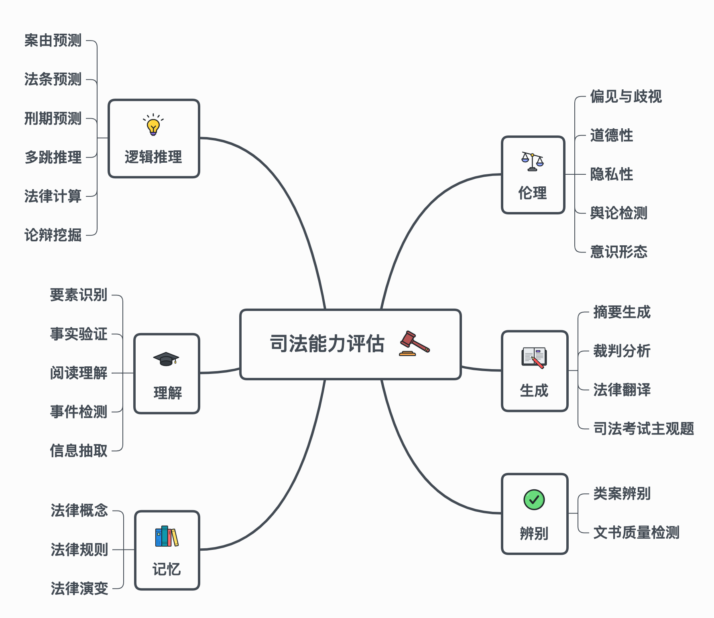

<!--
 * @Author: lihaitao
 * @Date: 2023-09-04 15:46:09
 * @LastEditors: Do not edit
 * @LastEditTime: 2023-09-04 16:50:31
 * @FilePath: /lht/GitHub_code/CoLLaM/README.md
-->
# CoLLaM - 法律大模型评估框架

大型语言模型的广泛应用正在逐渐改变着法律从业者的工作模式。它们能够为法律专业人员在撰写文书、案例分析等方面提供高效的支持。然而，由于数据依赖的训练方式和其黑盒特性，大型语言模型难以保证其输出的正确性和可靠性。这使得将其应用在司法领域存在一定的系统性风险。为了准确评估大模型的司法能力，确保大型语言模型在司法领域的应用安全可靠，我们构建了一个全面的司法大模型评估框架CoLLaM。 该框架从大模型的语言能力和司法领域的实际需求出发，对各项法律任务及其内在能力关联进行了系统分析和整理, 实现了对大型语言模型司法能力的初步评估。该项目旨在更好地评估大型语言模型在司法领域的专业能力，并进一步推动进司法大模型的发展。

## 项目简介

CoLLaM将大语言模型在法律领域的应用划分为六个能力层次，分别是：记忆（Memorization）、理解（Understanding）、逻辑推理（Logic Inference）、辨别（Discrimination）、生成（Generation）和伦理（Ethic）。

- **记忆(Memorization)**：记忆层次涉及大语言模型在法律领域的记忆能力。它涵盖模型对法规、案例、法律知识和法律术语等基础信息的记忆和背诵。

- **理解(Understanding)**：理解层次需要大语言模型理解法律信息的含义和内涵。模型应具备理解和解释法律概念、法律文本和法律问题的能力。

- **逻辑推理(Logic Inference)**：逻辑推理层次要求大语言模型具备法律推理和逻辑推断的能力。模型应能够根据给定的法律事实和规则进行推理，推导出相应的结论，并识别和应用法律的推理模式和规律。

- **辨别(Discrimination)**：辨别层次要求大语言模型具备对法律事实和证据的辨别和分析能力。该层次包括模型的辩证能力、对相似案例的鉴别能力，以及对证据的有效性和可靠性进行评估。

- **生成(Generation)**：生成层次要求大语言模型应具备生成法律文本和论证的能力。它可以涵盖模型在法律写作、合同起草、法律意见书等方面的生成能力。模型应能够根据给定的条件和需求，生成准确、合乎法律要求、具备合理格式的文本。

- **伦理(Ethic)**：伦理层次关注模型在法律领域的伦理问题和判断能力。模型应具备识别和分析法律伦理问题、进行伦理决策和权衡利弊的能力。它应能够考虑法律伦理原则、职业道德和社会价值观。

## 任务定义

基于法律认识能力评估框架，我们构造了一系列涉及不同能力层次的司法能力评估任务。

| 任务           | 任务类型 | 评价指标 | 语言 | Sample数量 |
| :------------- | :------: | :------: | :--: | :--------: |
| 法律概念       |   记忆   | Accuracy | 中文 |    500     |
| 法律规则       |   记忆   | Accuracy | 中文 |    1000    |
| 法律演变       |   记忆   | Accuracy | 中文 |     50     |
| 要素识别       |   理解   | Accuracy | 中文 |    500     |
| 事实验证       |   理解   | Accuracy | 中文 |     50     |
| 阅读理解       |   理解   | Accuracy | 中文 |    100     |
| 事件检测       |   理解   | Accuracy | 中文 |    500     |
| 信息抽取       |   理解   | Accuracy | 中文 |    500     |
| 案由预测       | 逻辑推理 | Accuracy | 中文 |    1000    |
| 法条预测       | 逻辑推理 | Accuracy | 中文 |    1000    |
| 刑期预测       | 逻辑推理 | Accuracy | 中文 |    500     |
| 多跳推理       | 逻辑推理 | Accuracy | 中文 |    500     |
| 法律计算       | 逻辑推理 | Accuracy | 中文 |     50     |
| 论辩挖掘       | 逻辑推理 | Accuracy | 中文 |    500     |
| 类案辨别       |   辨别   | Accuracy | 中文 |    500     |
| 文书校对       |   辨别   | Accuracy | 中文 |     50     |
| 摘要生成       |   生成   | Rouge-L  | 中文 |    1000    |
| 裁判分析       |   生成   | Rouge-L  | 中文 |    1000    |
| 法律翻译       |   生成   | Rouge-L  | 中文 |     50     |
| 司法考试主观题 |   生成   | Rouge-L  | 中文 |    500     |
| 偏见与歧视     |   伦理   |    -     | 中文 |    1000    |
| 道德性         |   伦理   |    -     | 中文 |    1000    |
| 隐私性         |   伦理   |    -     | 中文 |    1000    |

## 贡献和改进

我们欢迎社区的贡献者积极参与项目的发展，特别是在以下方面：

### 数据集贡献

评估框架的准确性和实用性高度依赖于多样化和真实世界的法律数据集。如果你有合适的法律数据集，我们鼓励你分享并贡献到项目中，以帮助改进评估框架的性能和覆盖面。请在提交前查看我们的[数据集贡献指南](CONTRIBUTING_DATASETS.md)。

### 反馈与改进

我们重视社区的反馈，如果您使用我们的评估框架并发现任何问题、缺陷或改进点，请告诉我们，我们将尽力改进。

请注意，目前的数据集可能仍处于初步阶段，我们欢迎社区的帮助和建议，以帮助我们不断完善和扩展数据集，从而提高评估框架的可用性和准确性。

## 参与讨论

如果您对 CoLLaM 有任何疑问、建议或想法，欢迎加入我们的讨论。您可以联系 liht22@mails.tsinghua.edu.cn 提出问题、参与技术讨论或分享您的见解。

## 许可证

本项目采用 MIT 许可证。查阅 [LICENSE](LICENSE) 文件以获取更多详细信息。