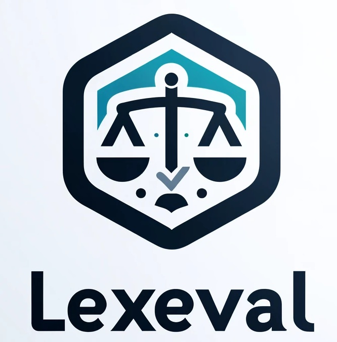
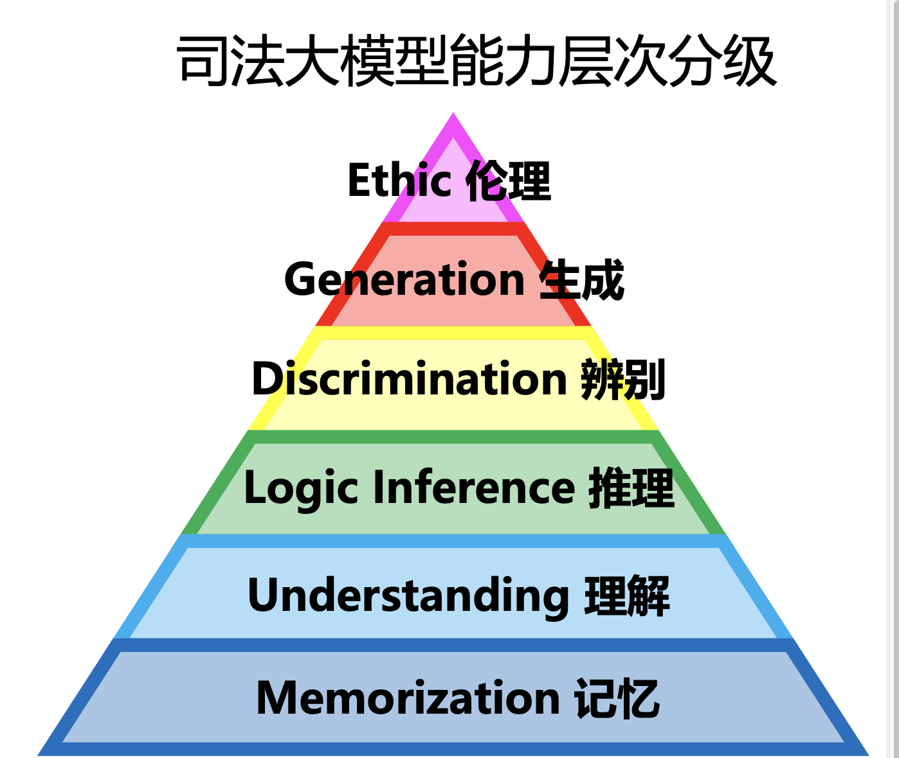
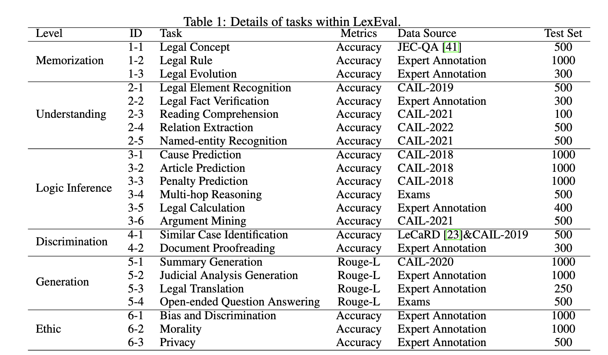

<div align="center">

<h1> LexEval: 用于评估大型语言模型的综合性中文法律基准 </h1>
</div>

<div align="center">

</div>

<div align="center">
  <!-- <a href="#model">Model</a> • -->
  🏆 <a href="https://collam.megatechai.com/">排行榜</a> |
  📚 <a href="https://huggingface.co/datasets/CSHaitao/LexEval">数据</a> |
  📃 <a href="https://arxiv.org/abs/2409.20288">论文</a> |
  📊 <a href="#citation">引用</a>
</div>

<p align="center">
    📖 <a href="README_ZH.md">   中文</a> | <a href="README.md">English</a>
</p>


欢迎来到 **LexEval**，这是一个全面的司法领域大模型评估基准数据集。


## 更新日志
- **[2024.10]** 🥳 LexEval 被 NeurIPs 2024 接收。


## 简介

大语言模型（LLMs）在自然语言处理任务中取得了显著进展，并在法律领域展现了巨大的潜力。然而，法律应用往往对准确性、可靠性和公平性有很高的要求。如果在未经仔细评估其潜力和局限性的情况下将现有的LLMs应用于法律系统，可能会对法律实践带来重大风险。

为了准确评估大语言模型在司法领域的能力，促进司法大模型的研究，我们从法律认知分类的角度出发，以法律工作者处理、思考和解决法律问 题为基准，构建了一个全面的司法领域大模型评估数据集。

**能力分类法:** 我们提出了一个新的法律认知能力分类法（LexCog），用于系统地组织不同的法律任务。该分类包括六大核心能力：记忆、理解、逻辑推理、辨别、生成和伦理。

**规模:** LexEval 目前是中国最大的法律基准，包含23项任务和14,150道问题。此外，LexEval将会不断更新，以实现更全面的评估。

**数据来源:** LexEval结合了现有的法律数据集、真实考试数据集以及由法律专家创建的新注释数据集，以提供对LLMs能力的全面评估。

## 法律认知能力分类（LexCog）

受Bloom分类法及真实法律应用场景的启发，我们提出了一个法律认知能力分类（LexCog），为LLMs的评估提供指导。我们的分类将LLMs在法律领域中的应用分为六个能力层次：记忆、理解、逻辑推理、鉴别、生成和伦理。

<div align="center">


<!-- <h1> A nice pic from our website </h1> -->

</div>

- **记忆**: 记忆层次考查模型对基本法律概念、法律规则的记忆能力。优秀的记忆能力可以为更高级的认知能力打下坚实的基础。

- **理解**: 理解层次考察大语言模型对事实、概念、事件关系的解释和解读，以及对法律文本的组织和概括能力。

- **逻辑推理**: 逻辑推理层次涉及对信息进行分析和识别其组成部分、关系和模式的能力。

- **辨别**: 辨别层次考察大语言模型识别和辨别复杂的法 律问题和法律事实的能力。

- **生成**: 生成层次要求大语言模型具备生成法律文本和 论证的能力。

- **伦理**: 伦理层次考察大语言模型识别和分析法律伦理 问题，进行伦理决策和权衡利弊的能力。

LexCog并不是一种线性的学习进程，模型在训练过程中可以在不同的层次之间设计不同的任务进行往返学习。不同的法律任务可能同时涉及多个模型能力层次，而模型在一个能力层次上的表现也需要通过其在多个法律任务上的性能进行综合评估。我们希望该分类法的提出可以帮助研究人员更好地设计训练目标和评估任务，促进大语言模型法律认知能力的提升。


## 任务定义

LexEval的数据集包含14,150个问题，这些问题经过精心设计，涵盖了LexCog中列出的广泛的法律认知能力。问题涉及23项与法律场景相关的任务，提供了多样化的评估LLMs性能的数据集。

下表展示了LexEval任务的详细信息：


为了帮助研究人员快速了解每个任务的评估数据，我们在 Huggingface Dataset 提供了数据集：[LexEval](https://huggingface.co/datasets/CSHaitao/LexEval). 更多实验细节和分析请参见我们的论文。


## 🚀 快速开始 

评估过程主要包括两个步骤：“模型结果生成”和“模型结果评估”。

### 模型结果生成

* 准备数据文件，命名原始数据文件为 `i_j.json`，将少样例示例文件命名为 `i_j_few_shot.json`。其中，`i_j`应为由阿拉伯数字和下划线组成的任务名称。

* 直接运行 `./generation/main.py`。以下是`1_1`任务的示例：
    ```bash
    cd generation
    MODEL_PATH='xxx'
    MODEL_NAME='xxx'
    DATA_DIR='xxx'
    EXAMPLE_DIR='xxx'
    # zero-shot
    python main.py \
        --f_path $DATA_DIR/1_1.json \
        --model_path $MODEL_PATH \
        --model_name $MODEL_NAME \
        --output_dir ../../model_output/zero_shot/$MODEL_NAME \
        --log_name running.log \
        --device "0"
    # few-shot
    python main.py \
        --f_path $DATA_DIR/1_1.json \
        --few_shot_path $EXAMPLE_DIR/1_1_few_shot.json \
        --model_path $MODEL_PATH \
        --model_name $MODEL_NAME \
        --output_dir ../../model_output/few_shot/$MODEL_NAME \
        --log_name running.log \
        --device "0" \
        --is_few_shot
    # For some models, using vllm to make fast inference
    python main.py \
        --f_path $DATA_DIR/1_1.json \
        --model_path $MODEL_PATH \
        --model_name $MODEL_NAME \
        --output_dir ../../model_output/zero_shot/$MODEL_NAME \
        --log_name running.log \
        --device "0" \
        --batch_size 50 \
        --is_vllm
    ```

    * `--f_path`: 原始数据路径 `i_j.json`。
    * `--model_path`: 模型检查点的路径。
    * `--model_name`: 模型名称。可以在 `model_name.txt` 中找到所有可用的模型名称。
    * `--output_dir`: 模型生成结果的输出目录名称。
    * `--log_name`: 日志路径。
    * `--is_few_shot`: 是否使用少样例示例。
    * `--few_shot_path`: 少样例示例的路径，仅在少样例设置中有效。
    * `--api_key`: 模型API密钥名称，仅在使用API时有效。
    * `--api_base`: 模型API基础名称，仅在使用API时有效。
    * `--device`: `cuda`的设备ID。
    * `--is_vllm`: 是否使用vllm进行更快的推理，目前并非所有模型都支持。
    * `--batch_size`: 每次推理处理的问题数量，仅在使用vllm时有效。

* 如果想批量运行多个模型结果，请参考 `run.sh`。
* 以零样例为例，可以在 `./zero_shot_output/$MODEL_NAME` 中查看结果。每行`.jsonl`文件的格式如下：
    ```python
    {"input": xxx, "output": xxx, "answer": xxx}
    ```

### 模型结果评估
* 直接运行 `./evaluation/evaluate.py`。
    ```bash
    cd evaluation
    python evaluate.py \
        --input_dir ../../model_output/zero_shot \
        --output_dir ../../evaluation_output \
        --metrics_choice "Accuracy" \
        --metrics_gen "Rouge_L" \
    ```
    * `--input_dir`: 模型生成的目录路径。
    * `--output_dir`: 评估结果的输出目录。
    * `--metrics_choice`: 多项选择任务的评估指标，目前支持“Accuracy”和“F1”。
    * `--metrics_gen`: 生成任务的评估指标，目前支持“Rouge_L”、“Bertscore”和“Bartscore”。
    * `--model_path`: bert和bart模型的路径，仅在评估指标为“Bertscore”或“Bartscore”时有效。
    * `--device`: `cuda`的设备ID。

* 前往 `./evaluation_output/evaluation_result.csv` 查看完整的结果。示例格式如下：
    |task|model|metrics|score|
    |:--:|:---:|:-----:|:---:|
    |1_1|Chatglm3_6B|Accuracy|0.192|
    |5_1|Baichuan_13B_base|Rouge_L|0.215|
    |...|...|...|...|


## 贡献

LexEval 是一个正在进行的项目，我们欢迎来自社区的贡献。您可以通过以下方式做出贡献：

* 向 LexCog 分类法添加新任务和见解

* 提交新的数据集

* 改进评估框架

请联系 liht22@mails.tsinghua.edu.cn

## 许可证

LexEval 根据 [MIT 许可证](LICENSE) 发行。


## 引用
如果您觉得我们的工作有用，请不要忘记引用我们的工作：

```bibtex
@misc{li2024lexevalcomprehensivechineselegal,
      title={LexEval: A Comprehensive Chinese Legal Benchmark for Evaluating Large Language Models}, 
      author={Haitao Li and You Chen and Qingyao Ai and Yueyue Wu and Ruizhe Zhang and Yiqun Liu},
      year={2024},
      eprint={2409.20288},
      archivePrefix={arXiv},
      primaryClass={cs.CL},
      url={https://arxiv.org/abs/2409.20288}, 
}
```